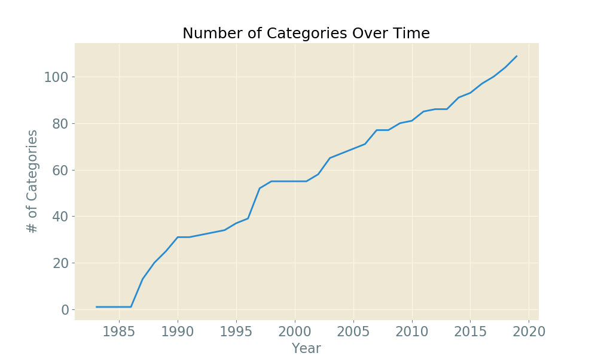
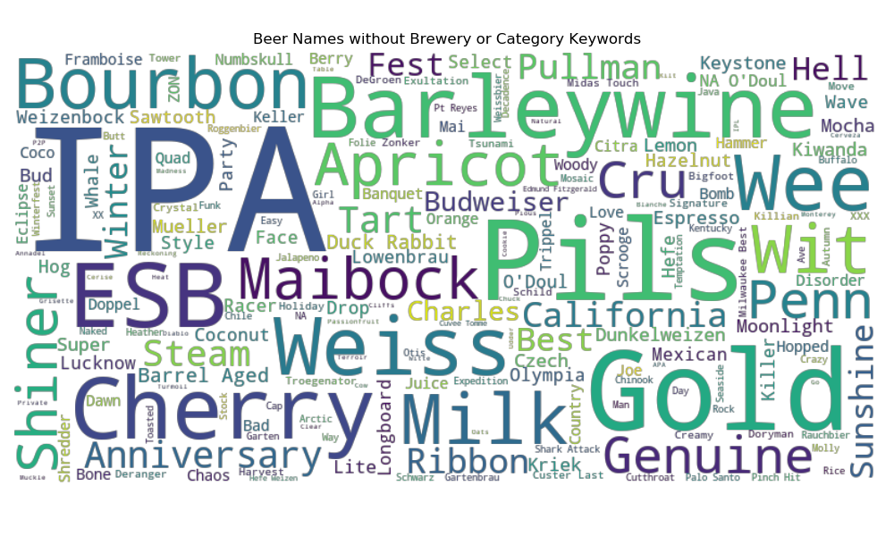

# Background
The Great American Beer Festival (shortened to GABF) is an annual beer festival/competition held in Denver, Colorado. The event was founded in 1982 in Boulder, CO and has grown to become the largest ticketed beer competition in the United States. In recent years the event has been held in the Colorado Convention Center, with as many as <strong>800</strong> participating breweries and <strong> 62,000</strong> attendees (2018).
  
The competition chooses winners by awarding bronze, silver, and gold medals for each beer category. GABF defines the criteria for these medals as:
| Award  	| Description                                                                                                                                                         	|
|--------	|---------------------------------------------------------------------------------------------------------------------------------------------------------------------	|
| Gold   	| A world-class beer that accurately exemplifies the specified style, displaying the proper balance of taste, aroma and appearance.                                   	|
| Silver 	| An excellent beer that may vary slightly from style parameters while maintaining close adherence to the style and displaying excellent taste, aroma and appearance. 	|
| Bronze 	| A fine example of the style that may vary slightly from style parameters and/or have minor deviations in taste, aroma or appearance.                                	|

 
 
My goal is to answer two questions:

1. Are there any features of Great American Beer Festival entries that reliably result in winning more medals?
1. Are GABF-medal-medals beers prefered to non-medal-winners?

# Data
GABF has published all of their award winners on [their website](https://www.greatamericanbeerfestival.com/the-competition/winners/). Although this data is formatted in an HTML table, I was not able to find a direct download. To begin exploring this data, I scraped the linked website using a combination of Selenium (to interact with JavaScript elements) and BeautifulSoup (to parse the HTML).
 
 
The dataset contains 6047 award winners, spanning the years of 1983-2019.
 
 

| Field     	| Description                                                  	|
|-----------	|--------------------------------------------------------------	|
| Medal     	| The award received (Gold, Silver, Bronze, Honorable Mention) 	|
| Beer Name 	| Name of the beer                               	|
| Brewery   	| Name of the brewery                            	|
| City      	| City in which the brewery operates                                          	|
| State     	| State in which the brewery operates                          	|
| Category  	| Beer category for which the award was given                            	|
| Year      	| Year the award was won                                       	|

# Exploratory Data Analysis
## Growth of the Competition
When examining time-series data related to the competition, an obvious trend is observed. Since its inception in 1983, the competition has significantly grown in participants, medals awarded, attendees, etc.
 
 

 
 
This makes sense, as the competition has grown, more medals get awarded. Since medals are awarded by category, if the number of medals awarded has increased, we would expect the same trend in the number of categories.
 
 

 
 
What about the number of participants? Does the Great American Beer Festival have representatives from every state?
 
 

 
 
Interesting! Although GABF has had entries from all 50 states over the lifetime of the event, it appears no specific year has had more than 40 states represented.

## Who Wins the Most?
We have established that the competition has had a near-linear growth in winners and categories, but who tends to bring home the medals? We can look at quite a few data points to answer that.

### Breweries
Which breweries have the most medals on their wall?
 
 

 
 
We see some <strong>very</strong> familiar names on this list. The top three: Pabst, Anheuser Busch, and Miller are some of the largest and oldest brewing companies in the country. Although they hardly meet the definition of "craft" breweries, it makes sense they'd be so well represented simply due to their age.
 
 
That is all fine and well, but let's look a bit more granular. Let's take a look at the medal-breakdown for these same breweries.
 
 

 
 
Some interesting data points here. Firstly, we can observe that out of 72 total medals won by Pabst, only 13 of those have been bronze (~18%). A clear breakout is Boston Beer Co., out of their 42 total medals, 23 of them are gold (~55%).

### States
Which states tend to bring home medals?
 
 

 
 
It seems like California and Colorado have the highest representation as far as medals are concerned. This makes sense, as CA and CO are both considered ahead-of-the-curve when it comes to craft beer, in fact the [Brewer's Association](https://www.brewersassociation.org/statistics-and-data/state-craft-beer-stats/) ranks California and Colorado first and second in terms of number of breweries in the country.
 
 
Nothing too surprising here, let's look at the medal breakdown for these states.
 
 

 
 
The data looks pretty similar, but we can observe that when CA and CO win, they seem to win more silver than gold. If we look at states like TX and WA, we can see that when breweries from their states win, they appear to win gold a bit more often; but not by much. Overall it seems like these states have a generally equal likelihood of winning gold, silver, or bronze.

### Cities
Which cities are best represented?
 
 

 
 
First thing I notice is that California doesn't have nearly the same representation when we break down winners by city. Why would this be the case? Perhaps because California's population is spread out over a larger area, they have fewer cities with high concentrations of winners. Even still, I'd expect to see more than one city in CA on this list!
 
 
A second interesting fact about this data, four out of the top fifteen winning cities are in Colorado! That is surprising, as I'd certainly expect cities like Golden to be less represented than a huge city like Boston. Perhaps this is simply due to the fact that the competition is held in CO, so CO breweries are more likely to enter. Even though GABF is the largest beer festival/competition in the country, it makes sense that tiny breweries in the state of MA are less likely to enter than similarly-sized breweries in the home-state of the competition.
 
 
Also interesting to see that Salt Lake City, Utah has the 10th most medals out of any city, but Utah wasn't even in the top 15 of medal-winning states.
 
 
Again, let's break it down by medal:
 
 

 
 
Whoa! There are a lot more discrepancies between medals than when we looked state-wide. Although Denver seems to win similar number of gold, silver, and bronze medals; cities like Boston, MA (thanks Boston Beer Co. for ~80% of those gold medals); Austin, TX; and Fort Collins, CO have won <em>many</em> more gold medals than silver or bronze. When they win, they seem to win big!
 
 
Looking at total medals, Denver is winning by a pretty solid margin, but if we just look at <strong>gold</strong> medals, we have a pretty close race! Portland, OR is only 9 gold medals behind us (compared to nearly 50 total medals). We can also see that Seattle, WA is actually 3rd in gold medal wins (compared to 4th in total medal wins); with Milwaukee, WI falling back nearly four places.
 
 

### Map Over Time
What does this data look like over time?
 

 
 
We see some familiar hotspots! Big concentration of medals in Denver, but also other cities in CO; such as Boulder, Fort Collins, and Golden seem to make our state look like quite the beer hub! California also seems to have quite the representation, with nearly half the state covered in points by 2019.
 
 
We can also recognize some of our other breakout cities on this chart; such as Portland, Seattle, Austin, and Chicago.
 
 
One surprise brought to light by this chart is all of the wins along the east coast. Although you wouldn't have guessed by looking at our Top 15 bar charts, the entire east coast turns into a slurry of dots by 2019, making it nearly impossible to even discern the states! Compared to middle America, the east coast has a serious concentration of good beer!

## Beer Names
Let's take a look at the names of these award-winning beers and see if we notice any trends.
 
 

 
 
Well, this isn't all that interesting. We see "Ale", "Pale Ale", "Stout", "Lager" are some of the biggest items on this word cloud. This is not that surprising, as those are all very popular <em>categories</em> for the competition. 
 
 
If we had to take something away from this chart, it is to include the style of your beer in its name!
 
 
Let's take a crack at removing some of these category keywords from our word cloud. While we are at it, let's remove some of the brewery names as well.
 
 

 
 
That is a bit better. We got rid of the official category names from our word cloud, but we still have a few stragglers like "IPA", "Pils", and "Barleywine". After some investigation, I found that although these are commonly known beer styles, they are not the <strong>official</strong> names used in GABF categories (for example, GABF uses the full name "India Pale Ale" rather than "IPA").
 
 
Even so, we can take a few inferences from this word cloud. We see a few descriptive words that appear quite frequently, such as "Cherry", "Milk", "Bourbon", "Gold", and "Apricot". It appears adjectives such as these have a positive impact on how well a beer is received. 
 
 
Perhaps these adjectives have a positive impact because it allows one to get some insight to what they are about to drink, rather than be surprised by a nondescript name.
 
 
For example, if you plan on premiering your new apricot-infused gold lager at the Great American Beer Festival, it appears the best name for it should contain the keywords "Apricot", "Gold", and "Lager".

# Analysis
After exhaustive exploration of all this data, it seems reasonable to ask: <strong>Are GABF-medal-awarded beers any better than other beers?</strong>
 
 
To answer this, I pulled in a dataset from [Kaggle](https://www.kaggle.com/rdoume/beerreviews) containing <strong>1,672,016</strong> beer reviews pulled from a review website called [BeerAdvocate](https://www.beeradvocate.com/). We assume each of these reviews is independent and identically distributed.
 
 
This dataset contains beer names, brewery names, and review scores rated 1-5. Let's explore one score in particular, the <strong>overall score</strong>. This score is intended to encapsulate the reviewer's overall preference of the beer (not necessarily an average of other provided scores).
 
 
After some cleaning and fuzzy matching, I was able to split this dataset into two samples: one sample contained 171,529 reviews, all specific to beers that have received a GABF medal; and the other sample contained 1,500,487 reviews, all specific to beers that have NOT won a medal at the Great American Beer Festival.
 
 
To test whether or not GABF winners score higher reviews than their counterparts, we consider the following hypothesis test:
 
 

    
     
     
    Where:
     
     
    
    

 
 
To confirm this, I chose an α of 0.1, and began to take a look at our samples. 
 
 

Sample 1 (reviews of non-GABF medal winners) had the following statistics:
 

| Statistic          	| Value     	|
|--------------------	|-----------	|
| Mean Review        	| 3.812268  	|
| Sample Size        	| 1,500,487 	|
| Standard Deviation 	| 0.720175  	|
| Standard Error     	| 0.000588  	|

 
 

Sample 2 (reviews of GABF medal winners) had the following statistics:
 

| Statistic          	| Value    	|
|--------------------	|----------	|
| Mean Review        	| 3.825187 	|
| Sample Size        	| 171,529  	|
| Standard Deviation 	| 0.777281 	|
| Standard Error     	| 0.001876 	|

 
 
The difference in our mean review scores is ~0.13, with the sample size of Sample 2 sitting at about 1/10 of Sample 1. Let's plot the distributions.
 
 

 
 
We notice our distributions hardly overlap at all! If we use these distributions to calculate a z-score and p-value, we see that our Sample 2 mean is nearly 22 standard deviations away from our Sample 1 mean, equating to a p-value of <strong>< .00001</strong>.
 
 

 
 
Since this calculated p-value is less than our chosen α of 0.1, we choose to reject the null in favor of the alternative hypothesis, concluding beers that win medals at the Great American Beer Festival get better reviews than beers that did not.
 
 

# Sources

* https://www.greatamericanbeerfestival.com/the-competition/about-the-beer-competition/
* https://www.greatamericanbeerfestival.com/info/faq/
* http://www.nbcnews.com/id/44430953
* https://www.brewersassociation.org/statistics-and-data/state-craft-beer-stats/
* https://www.kaggle.com/rdoume/beerreviews
* https://www.beeradvocate.com/